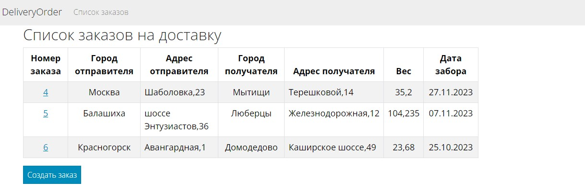
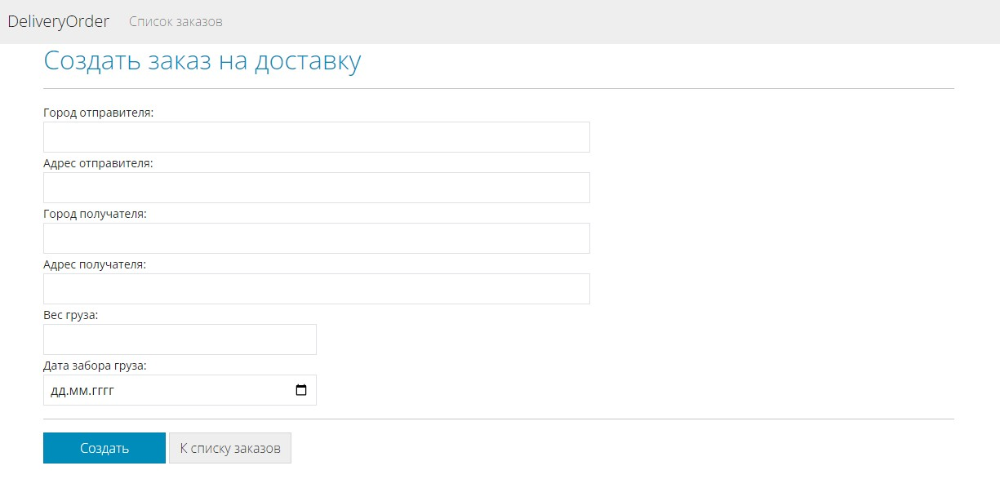
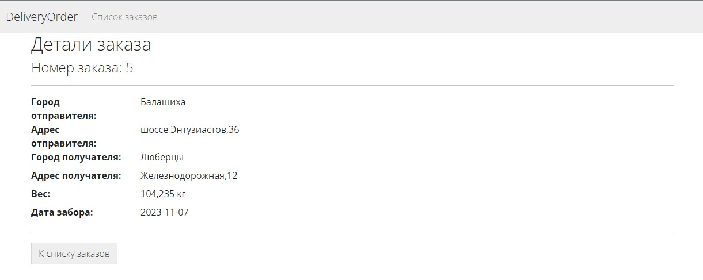

# DeliveryOrder

Описание задачи:

Реализовать простое Web приложение для приемки заказа на доставку со следующим функционалом:

1. Форма создания нового заказа (все поля обязательны для заполнения):
* Город отправителя
* Адрес отправителя
* Город получателя
* Адрес получателя
* Вес груза
* Дата забора груза

2. Форма отображения списка заказов: все созданные заказы должны отображаться в отдельной форме. Помимо полей, введенных пользователем при создании заказа, должен отображаться автоматически сгенерированный номер заказа.

3. Форма просмотра созданного заказа в режиме чтения. Должна открываться при клике на заказ в списке заказов.

Технологии:
* ASP.NET 6
* ASP.NET MVC
* Entity Framework
* SQL Server

Скриншоты:

